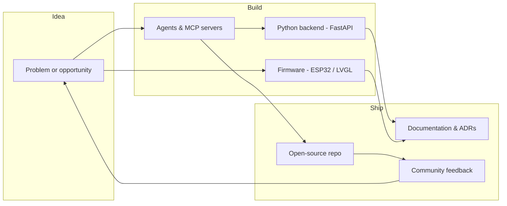

# 👋 Olá, I'm Leonardo Bora (The Neuromancer)
**AI Engineer** · building agents, MCP servers & hardware projects · **Google Student Ambassador 2026** · Trainee @ Lightera · Software Engineering @ PUCPR

I'm passionate about building **AI systems** that deliver real impact — balancing automation with empathy and usability. Right now I'm deep into **agentic workflows, MCP servers, and open-source hardware** — from smartwatches to automation hubs.

## 🏆 Highlights

- **🔴 Google Student Ambassador 2026** — selected for Google's student ambassador program; learning about AI, exploring the Gemini ecosystem and sharing knowledge with other students
- **🎙️ Momento Indústria (IEL Paraná)** — live radio talk on Jovem Pan FM & CBN Curitiba about youth employability and internships, telling my journey: Colégio SESI → intern → IEL Talents Award winner → Trainee
- **🎓 Perplexity AI Business Fellowship** — exclusive program collaborating globally with AI innovators
- **📄 Academic Publication** — research paper on AI Agents for Microentrepreneurs via WhatsApp (social impact & digital inclusion)
- **🏆 IEL Innovation Award 2025** — winner, "Innovative Intern - Large Company" category (Paraná regional stage)
- **🎮 Global Game Jam Winner** — "Capybara BubbleGum", highlighted by Curitiba's city officials
- **📰 Newsletter** — "Bora falar de IA?", 100+ subscribers, weekly AI insights for Brazilian professionals

## 🔭 What I'm building now (2026)

**⌚ [b0r4-watch](https://github.com/leonardobora/b0r4-watch)** — open-source personal smartwatch on the LILYGO T-Watch S3 (SX1262 915 MHz): ESP32/LVGL firmware + Python agent server (FastAPI) with voice AI, music and home automation.

**🔌 [mcp-wordpress](https://github.com/leonardobora/mcp-wordpress)** — MCP server for the WordPress REST API: manage pages, posts, shortcodes and Elementor content from your agent. Powers the [Curitiba Comedy Club](https://github.com/leonardobora/curitiba-comedy-club) site — where I also perform stand-up.

**🎯 [gupy-candidate-mcp](https://github.com/leonardobora/gupy-candidate-mcp)** — MCP server (PT-BR) that helps candidates apply to jobs on the Gupy platform.

**🔊 [discord-soundboard-bot](https://github.com/leonardobora/discord-soundboard-bot)** — Discord soundboard bot: plays sounds in call, adds new ones via `/adicionar` (yt-dlp).

**💡 [rgb-hub](https://github.com/leonardobora/rgb-hub)** — terminal automation hub for RGB lights (Tuya local) — no cloud, no app; syncs with screen and audio.

**🚗 [ka-obd-lab](https://github.com/leonardobora/ka-obd-lab)** — OBD-II/telemetry reading from a Ford Ka 2017, evolving into CAN bus reverse engineering.

## 🛤️ My journey so far

**Colégio SESI** → intern at Lightera → **IEL Talents Award 2025** → **Trainee at Lightera**, where I've earned the **Data Cabling Systems (DCS) Pro** and **Fiber Network Solutions Pro** certifications — learning how optical infrastructure (fibers, OTDRs, submarine cables) powers the digital world behind AI and cloud. I shared this path on the radio at Momento Indústria (see Highlights).

## 🧠 How I work

## 🚀 Tech Stack

  

**AI & Agents:** CrewAI, LangChain, Smolagents, LangFlow, LlamaIndex, MCP, OpenAI API, Perplexity API, Claude, Transformers, Hugging Face

**Backend:** Python, Django, FastAPI, SQL, REST APIs, Microservices, WebSockets, MQTT

**Cloud & Infrastructure:** Azure AI Studio, AWS, Docker, Linux, GPON/FTTx Networks

**Frontend:** React.js, HTML, CSS, JavaScript, Streamlit

**Hardware:** ESP32, Arduino, LVGL, PlatformIO, OBD-II/CAN, LoRa (SX1262)

**Methodologies:** Agile, Scrum, Software Product Ownership, Remote Team Management

---

*"Every bug is a chance to innovate; every audience is a new peer network."* ✨

**Let's Connect:**
- 💼 [LinkedIn](https://www.linkedin.com/in/leonardobora/)
- 📰 [Newsletter: Bora falar de IA?](https://www.linkedin.com/build-relation/newsletter-follow?entityUrn=7311017111898750977)
- 📧 leonardo.bora@outlook.com
- 🏠 Curitiba, PR, Brazil (UTC-3)

